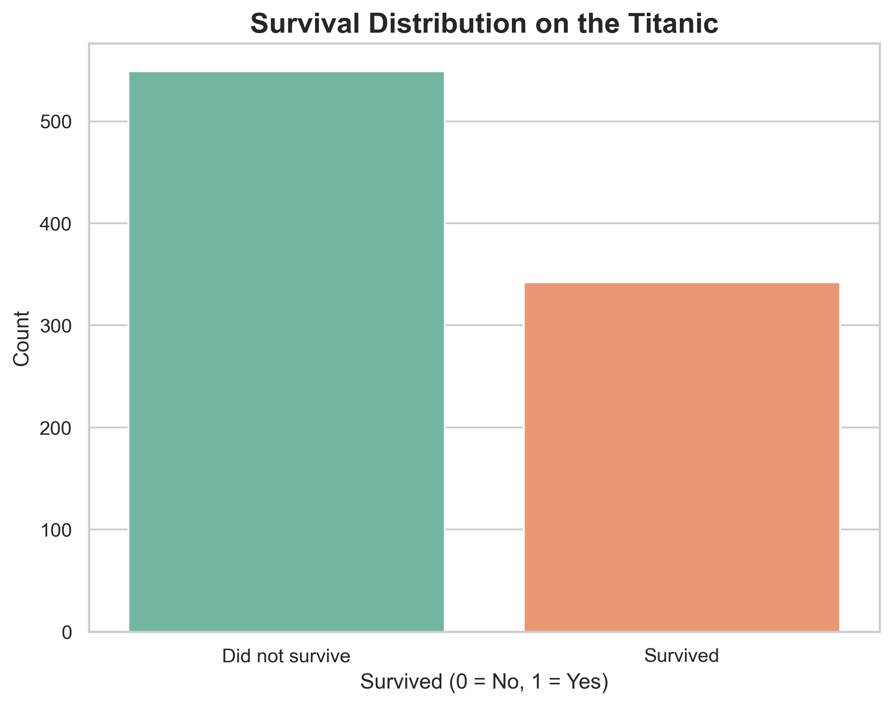
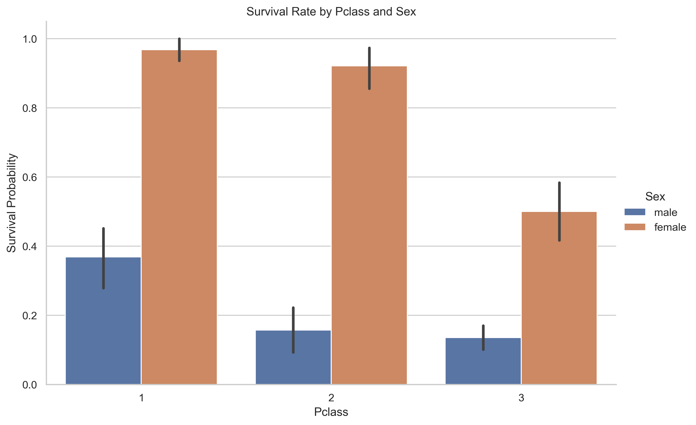
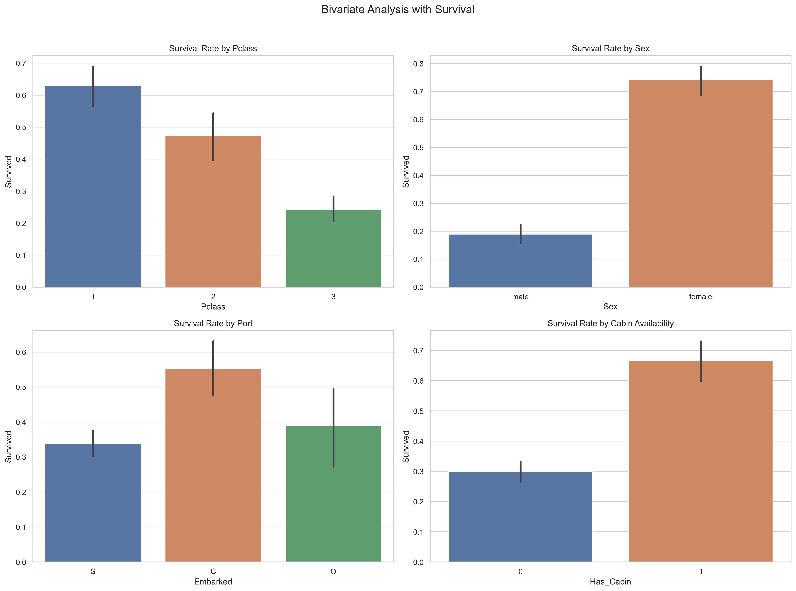
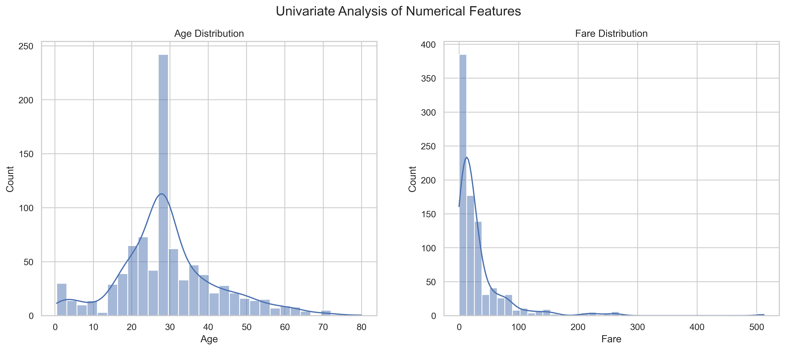
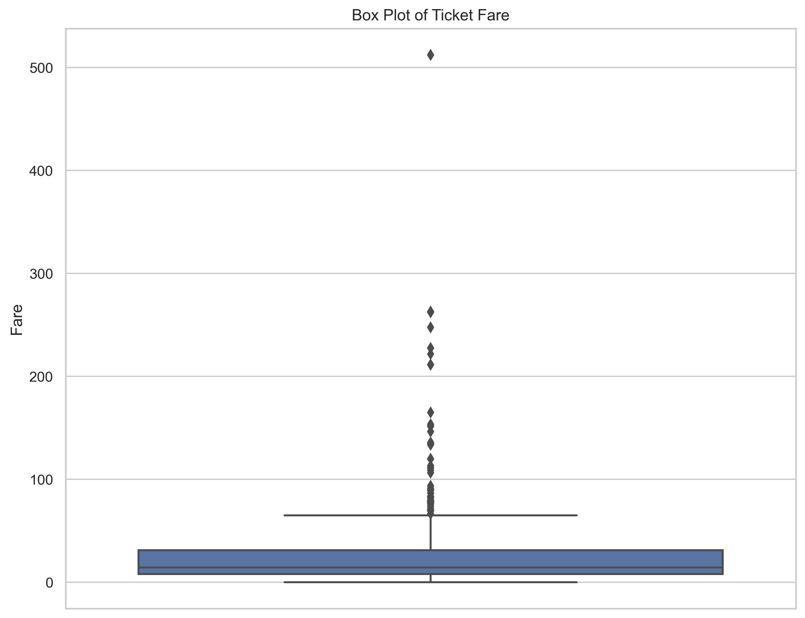
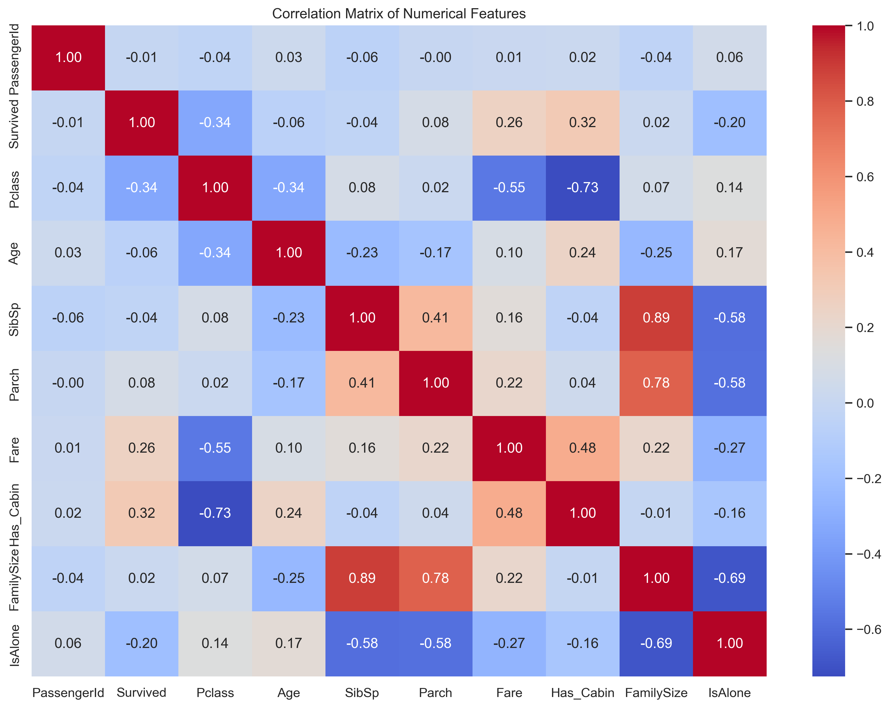
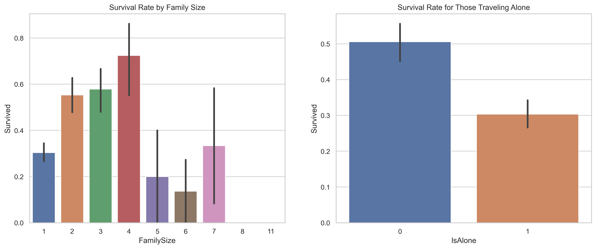
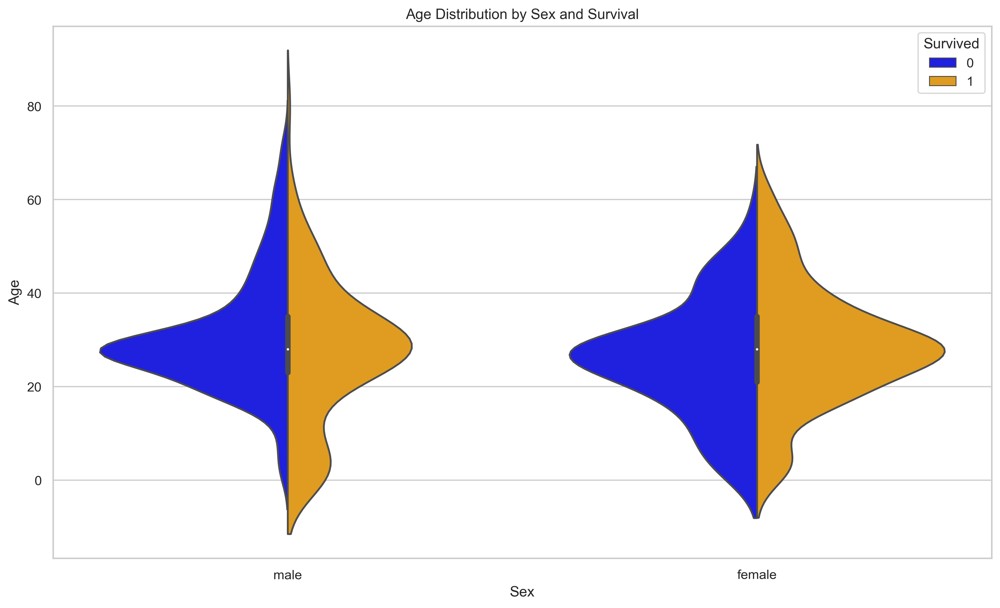

# 🚢 Titanic Survival Analysis: A Comprehensive Data Story

> **Uncovering the factors that determined survival on the RMS Titanic through end-to-end exploratory data analysis**

[](https://numpy.org/)
[](https://pandas.pydata.org/)
[](https://github.com/ydataai/ydata-profiling)
[](https://jupyter.org/)
[](https://seaborn.pydata.org/)
[](https://matplotlib.org/)

---

## 📋 Table of Contents
- [Project Overview](#-project-overview)
- [Key Findings](#-key-findings)
- [Dataset Information](#-dataset-information)
- [Analysis Workflow](#-analysis-workflow)
- [Technologies Used](#-technologies-used)
- [Installation & Setup](#-installation--setup)
- [Project Structure](#-project-structure)
- [Key Visualizations](#-key-visualizations)
- [Insights & Conclusions](#-insights--conclusions)
- [Future Work](#-future-work)
- [Author](#-author)

---

## 🎯 Project Overview

This project presents a **thorough exploratory data analysis (EDA)** of the infamous Titanic disaster, examining the socioeconomic and demographic factors that influenced passenger survival rates. Using Python's powerful data science libraries, we perform a step-by-step investigation that combines statistical analysis, data visualization, and feature engineering to tell the complete story hidden within the data.

**Project Objectives:**
- Perform comprehensive data cleaning and preprocessing
- Analyze survival patterns across multiple dimensions
- Engineer meaningful features to enhance predictive power
- Validate the historical "women and children first" narrative through data
- Provide actionable insights for predictive modeling

---

## 🔑 Key Findings

Our analysis reveals compelling patterns about survival on the Titanic:

### Primary Survival Factors

| Factor | Impact | Key Insight |
|--------|--------|------------|
| **Gender & Social Title** | ⭐⭐⭐⭐⭐ | Females had a **74% survival rate** vs. males at 19% |
| **Passenger Class** | ⭐⭐⭐⭐ | 1st class: 63% survived, 3rd class: only 24% survived |
| **Age** | ⭐⭐⭐ | Children under 10 had significantly higher survival rates |
| **Family Size** | ⭐⭐⭐ | Small families (2-4 members) had better odds than solo travelers |
| **Fare & Cabin** | ⭐⭐ | Higher fare passengers had better access to lifeboats |

### Critical Discoveries

1. **Social Inequality**: Clear stratification - wealth and social status directly correlated with survival
2. **Gender Disparity**: The "women and children first" protocol was strongly evident in the data
3. **Family Dynamics**: Traveling with a small family increased survival chances by 15-20%
4. **Port of Embarkation**: Cherbourg passengers had higher survival rates (likely due to higher first-class proportion)

---

## 📊 Dataset Information

- **Source**: Kaggle Titanic Dataset
- **Records**: 891 passengers
- **Features**: 12 variables (demographic, social, and ticket information)
- **Target Variable**: Survived (0 = No, 1 = Yes)

### Original Features
```
PassengerId, Survived, Pclass, Name, Sex, Age, SibSp, Parch, 
Ticket, Fare, Cabin, Embarked
```

### Engineered Features
- **Title**: Extracted from name (Mr, Mrs, Miss, Master, Rare)
- **FamilySize**: Total family members aboard (SibSp + Parch + 1)
- **IsAlone**: Binary indicator for solo travelers
- **Has_Cabin**: Binary indicator for cabin information availability
- **AgeGroup**: Categorical age binning (Child, Teen, Adult, Senior)

---

## 🔄 Analysis Workflow

Our systematic approach follows industry-standard EDA practices:

```
1. Data Loading & Inspection
   └── Initial data quality assessment
   
2. Data Cleaning
   └── Missing value imputation (Age, Cabin, Embarked)
   └── Data type conversions
   
3. Univariate Analysis
   └── Distribution analysis for individual variables
   └── Outlier detection and treatment
   
4. Bivariate Analysis
   └── Survival vs. categorical features
   └── Survival vs. numerical features
   └── Cross-tabulations and statistical tests
   
5. Feature Engineering
   └── Title extraction from names
   └── Family size and alone status
   └── Age grouping and cabin indicators
   
6. Multivariate Analysis
   └── Complex relationships between features
   └── Interaction effects exploration
   
7. Correlation Analysis
   └── Feature interdependencies
   └── Correlation heatmaps
   
8. Automated Profiling
   └── Comprehensive report generation with ydata-profiling
```

---

## 🚀 Installation & Setup

### Prerequisites
- Python 3.8 or higher
- pip package manager

### Quick Start

1. **Clone the repository**
```bash
git clone <repository-url>
cd DAY1
```

2. **Install dependencies**
```bash
pip install -r requirements.txt
```

3. **Launch Jupyter Notebook**
```bash
jupyter notebook Data_Storytelling_Analysing_Survival_on_the_Titanic.ipynb
```

4. **Run all cells** to reproduce the analysis

---

## 📁 Project Structure

```
DAY1/
│
├── Data_Storytelling_Analysing_Survival_on_the_Titanic.ipynb  # Main analysis notebook
├── Titanic-Dataset.csv                                         # Raw dataset
├── requirements.txt                                            # Python dependencies
├── titanic.html                                                # Automated profiling report
└── README.md                                                   # Project documentation
```

---

## 📈 Key Visualizations

This analysis includes a rich collection of visualizations that tell the complete data story.
**For detailed analysis of each image, open the notebook [`Data_Storytelling_Analysing_Survival_on_the_Titanic.ipynb`](./Data_Storytelling_Analysing_Survival_on_the_Titanic.ipynb) in this folder.**

### Survival Distribution

*Overall survival distribution showing the tragic loss of life - 62% perished*

### Gender & Class Analysis
<p float="left">
  
  
</p>

*Left: Survival rates by gender showing strong "women first" protocol. Right: Class-based survival hierarchy*

### Age Distribution

*Age distribution of passengers with survival overlay - children had better chances*

### Fare Analysis

*Box plot showing fare distributions across passenger classes - clear economic stratification*

### Correlation Heatmap

*Correlation matrix revealing relationships between numerical features - Fare and Pclass strongly correlated*

### Family Size Impact

*Survival rates by family size - small families (2-4) had the best odds*

### Multivariate Analysis

*Scatter plot of Age vs Fare colored by survival status and faceted by class*

---

**Visualization Standards:**
- ✅ Clear titles and axis labels
- ✅ Consistent color schemes (seaborn style)
- ✅ Informative legends
- ✅ Professional styling
- ✅ High-resolution exports (300 DPI)

---

## 💡 Insights & Conclusions

### Statistical Significance

Our analysis confirms several historical accounts while revealing nuanced patterns:

1. **Gender was the dominant factor**: Women had a **3.9x higher** survival rate than men
2. **Class hierarchy persisted in crisis**: 1st class passengers were **2.6x more likely** to survive than 3rd class
3. **Age mattered, but differently for genders**: Young boys ('Master') survived more than adult men, while female survival was high across all ages
4. **Economic status proxy**: Cabin availability and fare amount served as strong wealth indicators

### Data-Driven Narrative

The data paints a vivid picture of the Titanic disaster:
- Lifeboat access was clearly stratified by social class
- The "women and children first" protocol was enforced, but not uniformly across classes
- Families faced complex trade-offs - small families fared better, suggesting coordination challenges
- Port of embarkation reflected passenger demographics (Cherbourg = wealthier passengers)

---

## 🔮 Future Work

### Potential Extensions
- Build predictive machine learning models (Random Forest, XGBoost, Neural Networks)
- Perform advanced feature engineering (polynomial features, interaction terms)
- Conduct survival analysis using Kaplan-Meier curves
- Implement SHAP values for model interpretability
- Create an interactive dashboard using Plotly Dash or Streamlit
- Compare survival patterns with other maritime disasters

---

## 🙏 Acknowledgments

- Dataset provided by [Kaggle](https://www.kaggle.com/c/titanic)
- Inspired by the historical RMS Titanic tragedy of April 15, 1912
- Built with Python's amazing data science ecosystem

---

**⭐ If you found this analysis insightful, please consider starring this repository!**